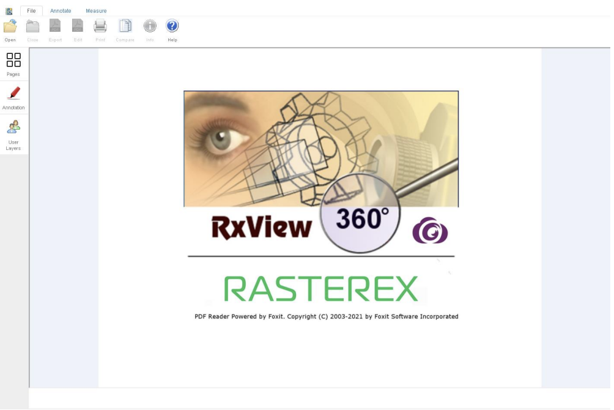

## Overview
RxView360 client consists of a single HTML page that acts as an independent complete viewer. The HTML page can be modified to customize the operation, with several functions available to operate on files and markup displayed in the viewer.

<!--  -->

